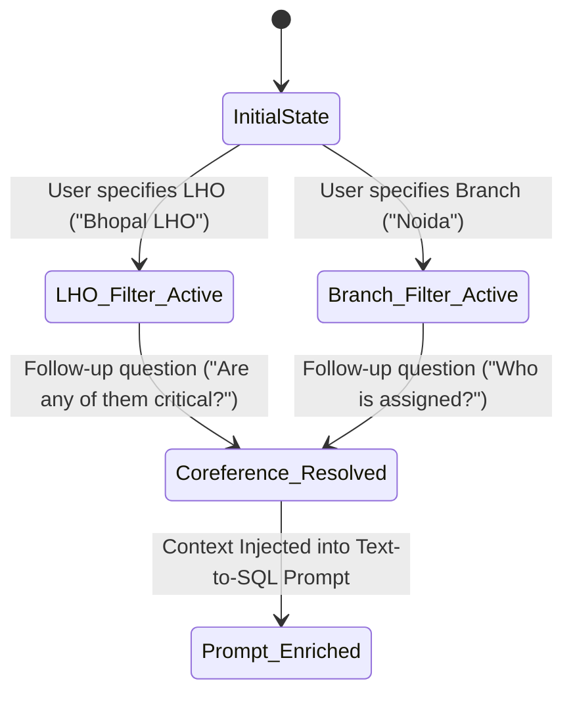
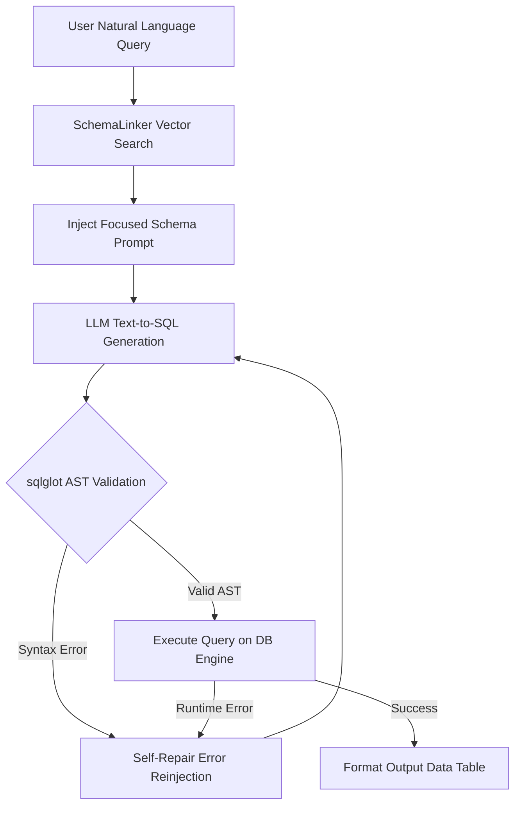

# 🔬 Technical Architecture Documentation: SBI CMS NLP Text-to-SQL Gateway

This document provides a deep, low-level technical specification of the **SBI CMS Intelligence Text-to-SQL Engine**. It covers vector embedding schema linking, distinct value sampling, dialogue coreference state tracking, self-repair execution loops, and Shadow DOM encapsulation mechanics.

---

## 1. System Overview & Technical Stack

The gateway bridges unstructured operator natural language queries and structured database management systems (MS SQL Server / SQLite) without relying on static, hardcoded prompt schemas.

| Subsystem | Technology / Library | Purpose |
|---|---|---|
| **API Gateway** | FastAPI, Uvicorn (ASGI) | Async REST endpoint handling, CORS, static plugin hosting |
| **Vector Embeddings** | `sentence-transformers` (`all-MiniLM-L6-v2`) | 384-dimensional dense vector embeddings for schema linking |
| **Database ORM** | SQLAlchemy 2.0, `pyodbc`, `mssql+pyodbc` | Connection pooling, dynamic schema introspection |
| **SQL Parser & AST** | `sqlglot` | Query validation, dialect translation, syntax sanity checks |
| **Plugin Isolation** | Web Components Shadow DOM (`shadowRoot`) | 100% style isolation for client-side widget embeddings |
| **Local LLM Engine** | Ollama (`deepseek-r1:8b`, `qwen2.5-coder:7b`) | Text-to-SQL generation and self-repair reasoning |

---

## 2. Dynamic Database Introspection (`SchemaEngine`)

* **Source File**: [`backend/app/schema_engine.py`](file:///d:/NLP-chat-bot-sql/backend/app/schema_engine.py)

### 2.1 Table Filtering & Prioritization
The `SchemaEngine` is strictly scoped to approved SBI CMS tables only:

$$\text{Allowed Tables} = \{\text{vw\_AlertReporting}, \text{AlertsDetails}, \text{AlertAttachment}, \text{RawAttachments}, \text{Jurisdiction\_mstr}, \text{Junction\_mstr}, \text{Sensor\_Master}\}$$

### 2.2 Bounded Subquery Distinct Value Sampling
Unindexed text column scans across millions of rows can cause full table scans. To extract sample categorical values in sub-second time, `SchemaEngine` executes bounded nested subquery sampling:

```sql
SELECT TOP 20 [col_name]
FROM (
    SELECT TOP 200 [col_name]
    FROM [table_name]
    WHERE [col_name] IS NOT NULL
) AS sample_sub
GROUP BY [col_name];
```

### 2.3 Dense Vector Representation
Each table $T_i$ and column $C_{ij}$ is represented as a textual semantic summary vector $\vec{v} \in \mathbb{R}^{384}$ using `all-MiniLM-L6-v2`:

$$\vec{v}_{table} = \text{Embed}\left(\text{"Table: " } + T_i + \text{", Columns: " } + \sum C_{ij} + \text{", Sample values: " } + \sum V_{ijk}\right)$$

---

## 3. Semantic Schema Linker & Categorical Value Grounding (`SchemaLinker`)

* **Source File**: [`backend/app/schema_linker.py`](file:///d:/NLP-chat-bot-sql/backend/app/schema_linker.py)

### 3.1 Vector Cosine Similarity Schema Linking
Given a natural language query $Q$, its vector embedding $\vec{q} = \text{Embed}(Q)$ is compared against all table vectors $\{\vec{v}_{T_1}, \vec{v}_{T_2}, \dots\}$ using Cosine Similarity:

$$\text{Sim}(Q, T_i) = \frac{\vec{q} \cdot \vec{v}_{T_i}}{\|\vec{q}\| \|\vec{v}_{T_i}\|}$$

Tables exceeding similarity threshold $\tau \ge 0.35$ are selected for inclusion in the focused prompt context.

### 3.2 Categorical Entity Value Grounding
User queries frequently contain colloquial or partial string references (e.g. `"nariman point"`, `"mumbai"`). The grounder performs token intersection matching against sampled database categorical string values:

$$\text{MatchScore}(Q_{token}, V_{db}) = \frac{|Q_{token} \cap V_{db}|}{|Q_{token}|} \times \mathbb{I}(\text{Substring Match})$$

When a match occurs, the linker explicitly injects value grounding hints into the system prompt:
```text
[GROUNDED ENTITY HINT]: The user mention 'nariman point' maps to exact database value 'SBI Nariman Point' in column Area / Location. Use 'LIKE %Nariman Point%' in SQL WHERE clause.
```

---

## 4. Multi-Turn Dialogue Context State Machine (`ContextTracker`)

* **Source File**: [`backend/app/context_tracker.py`](file:///d:/NLP-chat-bot-sql/backend/app/context_tracker.py)

The `ContextTracker` maintains persistent conversation state across sequential user turns.



### State Resolution Rules
1. **LHO Filter Persistence**: Captures active LHO selection (e.g., `active_lho_filter = "Bhopal LHO"`).
2. **Branch Filter Persistence**: Captures active branch selection (e.g., `active_branch_filter = "SBI Nariman Point"`).
3. **Coreference Expansion**: When follow-up queries contain pronouns (*"them"*, *"it"*, *"these"*), `ContextTracker` rewrites the prompt to explicitly append the active filter parameters.

---

## 5. Automated AST Validation & 1-Shot Self-Repair Loop

* **Source File**: [`backend/app/pipeline/self_correction.py`](file:///d:/NLP-chat-bot-sql/backend/app/pipeline/self_correction.py)



### Self-Repair Reinjection Logic
If SQL execution throws a database exception (e.g. `pyodbc.ProgrammingError: Invalid column name 'cam_status'`), the system catches the exception and reinjects it into the LLM with a 1-shot retry prompt:

```text
[SYSTEM SELF-REPAIR ERROR NOTICE]:
The previous SQL query failed execution with error: Invalid column name 'cam_status'.
Correct column names in table CameraList are: [CameraId, CameraName, CameraLocation, Area, Status].
Please rewrite the SQL query using correct column names.
```

---

## 6. Shadow DOM Plugin Encapsulation Architecture

* **Source File**: [`frontend/src/plugin.jsx`](file:///d:/NLP-chat-bot-sql/frontend/src/plugin.jsx)

To prevent CSS collisions between external host web portals and the chatbot widget, the plugin implements W3C Web Components **Shadow DOM**:

```javascript
// Shadow DOM Encapsulation
const shadow = container.attachShadow({ mode: 'open' });

// Inject scoped stylesheet inside shadow root
const linkEl = document.createElement('link');
linkEl.rel = 'stylesheet';
linkEl.href = `${gatewayUrl}/plugin/widget.css`;
shadow.appendChild(linkEl);

// Mount point inside isolated shadow boundary
const renderTarget = document.createElement('div');
shadow.appendChild(renderTarget);

const root = ReactDOM.createRoot(renderTarget);
root.render(<FloatingWidget {...options} />);
```

---

## 7. Windows Server Unattended Service Mechanics

* **Source Files**: [`run_backend.bat`](file:///d:/NLP-chat-bot-sql/run_backend.bat), [`setup_windows_server.ps1`](file:///d:/NLP-chat-bot-sql/setup_windows_server.ps1)

### Scheduled Task Parameters
* **Task Name**: `SbiCmsGatewayTask`
* **Security Principal**: `NT AUTHORITY\SYSTEM`
* **Logon Type**: `ServiceAccount` (Runs 24/7 without user interactive logon)
* **Run Level**: `Highest`
* **Restart Policy**: `RestartCount = 3`, `RestartInterval = 1 minute`

### PowerShell Command Execution
```powershell
Register-ScheduledTask `
    -TaskName "SbiCmsGatewayTask" `
    -Action (New-ScheduledTaskAction -Execute "cmd.exe" -Argument "/c `"$batPath`"") `
    -Trigger (New-ScheduledTaskTrigger -AtStartup) `
    -Principal (New-ScheduledTaskPrincipal -UserId "NT AUTHORITY\SYSTEM" -LogonType ServiceAccount) `
    -Settings (New-ScheduledTaskSettingsSet -StartWhenAvailable -RestartCount 3) `
    -Force
```

---

## 8. Standalone PyInstaller Compilation & Service Launcher Mechanics

* **Source Files**: [`SbiCmsGateway.spec`](file:///d:/NLP-chat-bot-sql/SbiCmsGateway.spec), [`build_exe.bat`](file:///d:/NLP-chat-bot-sql/build_exe.bat), [`start_server.bat`](file:///d:/NLP-chat-bot-sql/start_server.bat), [`launcher.py`](file:///d:/NLP-chat-bot-sql/launcher.py)

### 8.1 Frozen Asset Resolution
In frozen executable bundles (`sys.frozen = True`), PyInstaller extracts data files into a temporary directory `sys._MEIPASS`. The backend resolves asset paths dynamically:

```python
if getattr(sys, 'frozen', False):
    bundle_dir = getattr(sys, '_MEIPASS', os.path.dirname(sys.executable))
    possible_plugin_dirs.insert(0, os.path.join(bundle_dir, "backend", "plugin_assets"))
    possible_plugin_dirs.insert(0, os.path.join(bundle_dir, "plugin_assets"))
```

### 8.2 Firewall Rule Automation (`start_server.bat`)
```cmd
netsh advfirewall firewall add rule name="SBI_CMS_Gateway_8001" dir=in action=allow protocol=TCP localport=8001
```
This enables zero-configuration client connectivity across local subnet branches.
